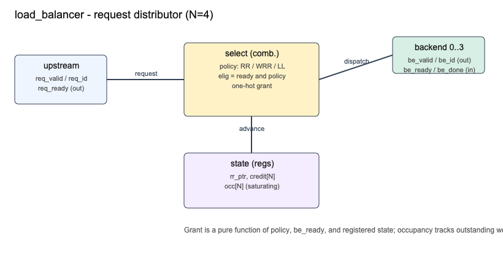
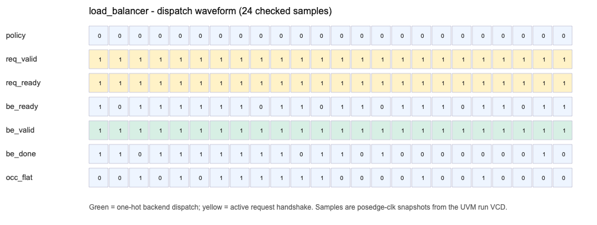

# LoadBalancer - Multi-Policy Request Distributor Verification

A hardware analog of a systems-design load balancer: one upstream request
stream distributed across `N=4` backend servers by a runtime-selectable policy
(round-robin, weighted round-robin, least-loaded), with per-backend
backpressure and outstanding-request tracking. Verified with a full UVM
environment in Questa and a bound SVA property set proven in Synopsys VC Formal,
with a bug-injection traceability matrix on both sides.

## Proof Summary

| Evidence | Result |
| --- | --- |
| Clean Questa farm run | `Errors: 0`, `Warnings: 0` on all 19 compiles; `UVM_ERROR: 0`, `UVM_FATAL: 0`; 0 assertion failures |
| UVM tests | 5 tests (RR, WRR, LL, mixed, backpressure), 0 scoreboard mismatches each |
| Coverage | 100.00% total covergroup coverage across 2 covergroup types |
| Final verdict | `No errors -- passed testbench` |
| Negative run | `BUG_LL_NOTMIN` yields 1146 LL scoreboard mismatches and `Failed testbench` (RR/WRR stay clean, localizing the fault) |
| Clean formal proof | 17 assertions proven (all non-vacuous), 3 covers reached, 0 falsified |
| Formal bug matrix | 6/6 `BUG_*` mutations each falsify their mapped property; 4 falsify only that property, 2 (`BUG_DOUBLE_GRANT`, `BUG_GRANT_NOTREADY`) also falsify related properties |
| Evidence gate | `check_evidence.sh` -> `OK (7 formal tails, 5 UVM tests clean, coverage 100.00%)` |
| Artifacts | `MANIFEST.txt`, `transcript.txt`, `transcript_negative.txt`, `waveforms.png`, `block_diagram.png`, `waveform_samples.csv`, `formal/logs/*.log` |





## Verification Architecture

| Component | Responsibility |
| --- | --- |
| `lb_ref.svh` | Single golden reference: predicts the granted backend index from policy, ready mask, and shadow state. Shared by the scoreboard. |
| `lb_sequence` | Five streams: one per policy, a mixed-policy burst stream, and a backpressure stress (including a directed saturation pile-up). |
| `lb_driver` | Drives one transaction per clock at posedge (NBA), so the combinational grant settles within the cycle. |
| `lb_monitor` | Samples at negedge - the coherent point where inputs, the combinational grant, and registered occupancy are all stable. |
| `lb_scoreboard` | Cycle-accurate shadow model: keeps its own `rr_ptr`/`credit`/`occ`, predicts via `lb_ref`, checks `req_ready`, one-hot dispatch, and every occupancy counter each cycle. |
| `lb_coverage` | Crosses policy x backend-ready pattern x occupancy bucket, plus request/drain/backpressure handshake states. |
| `load_balancer_sva` | Bound SVA checker (shared by sim and formal); DUT carries no assertions. |

## Formal Property Set

Clean run (`formal/fpv_run_lb.tcl`, VC Formal V-2023.12-SP2-3): all proven, non-vacuous.

| Property | Type | Checks |
| --- | --- | --- |
| `a_grant_onehot` | safety | at most one backend granted per cycle |
| `a_grant_only_ready` | safety | never grant a backend that is not ready |
| `a_no_drop` | safety | a live request with an eligible backend dispatches exactly one |
| `a_no_phantom` | safety | no dispatch without an accepted request |
| `a_occ_no_overflow` (x4) | safety | occupancy never exceeds `MAX_OUTSTANDING` |
| `a_wrr_weight0_never` (x4) | safety | a weight-0 backend is never granted under WRR |
| `a_ll_picks_min` (x4) | safety | LL grants the minimum-occupancy ready backend |
| `a_rr_bounded_fairness` | bounded-safety | RR pointer advances to `grant_idx+1` (implies no starvation) |
| `c_accept`, `c_backpressure`, `c_ll_tie` | cover | non-vacuity witnesses |

An input assumption (`m_policy_legal`) restricts the config port to the three
defined policy encodings.

## Bug-Injection Traceability

Each `BUG_*` define (in `load_balancer.sv`, guarded by `` `ifdef ``) mutates the
design to violate one targeted property. Formal falsifies the mapped property;
`BUG_DOUBLE_GRANT` and `BUG_GRANT_NOTREADY` also falsify related properties
(see `formal/logs/`). The UVM scoreboard catches `BUG_LL_NOTMIN` in simulation.

| Define | Mutation | Falsifies |
| --- | --- | --- |
| `BUG_DOUBLE_GRANT` | light a second grant bit | `a_grant_onehot` |
| `BUG_GRANT_NOTREADY` | ignore `be_ready` in select | `a_grant_only_ready` |
| `BUG_OCC_OVERFLOW` | drop the occupancy clamp | `a_occ_no_overflow` (depth 13) |
| `BUG_WRR_ZERO` | drop the weight-0 exclusion | `a_wrr_weight0_never` |
| `BUG_LL_NOTMIN` | take lowest index, not min occupancy | `a_ll_picks_min` |
| `BUG_RR_STUCK` | freeze the round-robin pointer | `a_rr_bounded_fairness` |

## Interface

| Signal | Dir | Width | Meaning |
| --- | --- | --- | --- |
| `policy` | in | 2 | `00` RR, `01` WRR, `10` LL |
| `weight` | in | N*4 | per-backend WRR weight (packed) |
| `req_valid` / `req_id` / `req_ready` | in/in/out | 1/8/1 | upstream request handshake |
| `be_ready` / `be_valid` / `be_id` / `be_done` | in/out/out/in | N/N/8/N | backend backpressure, one-hot dispatch, id, completion |
| `occ_flat` | out | N*4 | per-backend outstanding counters (packed) |

## Evidence Files

| File | Contents |
| --- | --- |
| `transcript.txt` | Clean Questa run: 19 clean compiles, 5 passing tests, 100% coverage, pass verdict |
| `transcript_negative.txt` | `BUG_LL_NOTMIN` run: scoreboard mismatches + `Failed testbench` |
| `formal/logs/fpv_run_lb.log` | Clean formal proof tail with `EVIDENCE_VERDICT` |
| `formal/logs/fpv_run_lb_bug_*.log` | Six bug-injected proof tails, each with `falsified >= 1` |
| `formal/logs/uvm_regression.log` | Curated UVM per-test + coverage + verdict tail |
| `waveforms.png`, `block_diagram.png`, `waveform_samples.csv` | Rendered from the clean-run VCD by `make_artifacts.py` |
| `MANIFEST.txt` | Farm host, tool versions, exact commands, results |

## Running

```tcl
# clean simulation (from a Questa shell)
do run.do
```

```bash
# clean simulation, non-interactive
vsim -c -do "do run.do; quit -f" | tee transcript.txt

# formal (from the formal/ directory, VC Formal on PATH)
vcf -batch -f fpv_run_lb.tcl
LB_BUG=BUG_RR_STUCK vcf -batch -f fpv_run_lb_buginjected.tcl

# full evidence capture + validation on the farm
cd formal && bash capture_evidence.sh && bash check_evidence.sh

# regenerate artifacts from a run's VCD
python3 make_artifacts.py
```
