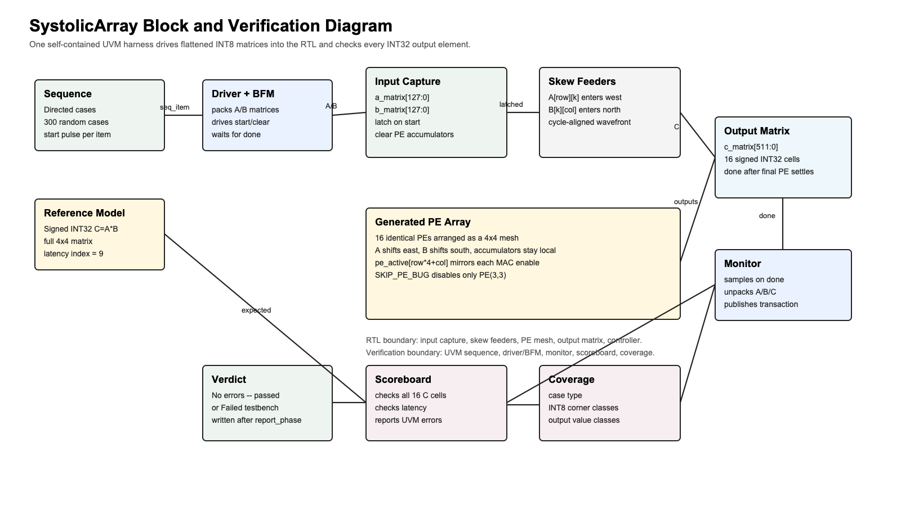
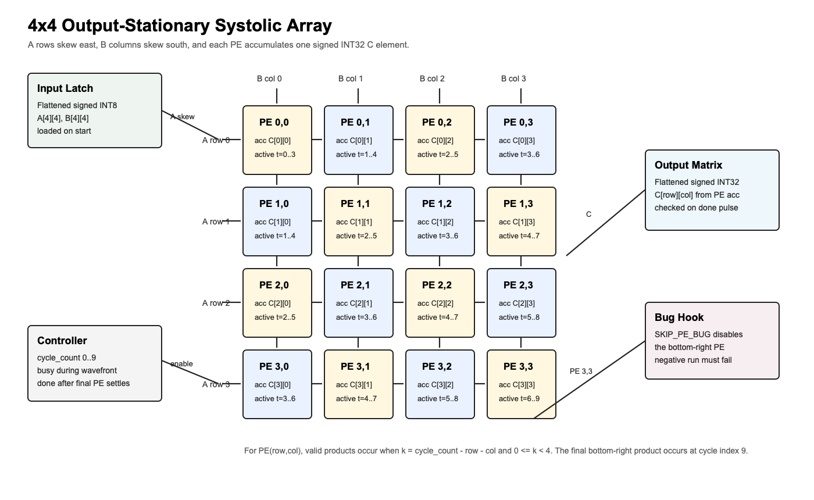
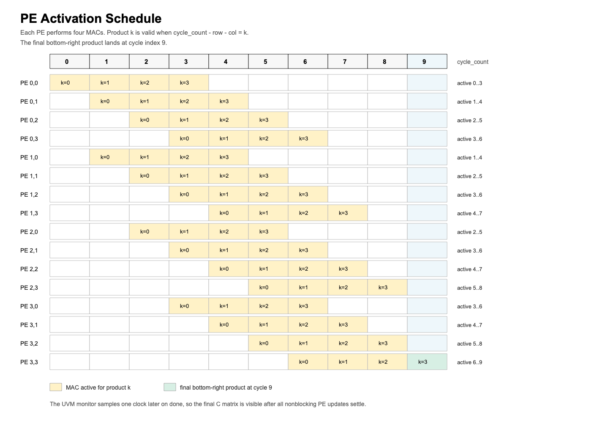
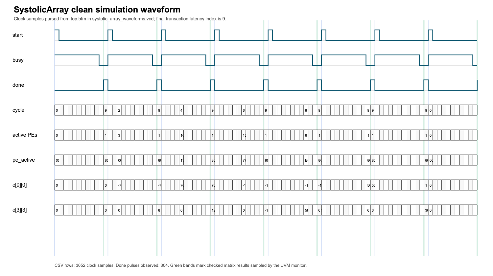

# SystolicArray

`systolic_array` is a 4x4 INT8 output-stationary matrix-multiply tile. Each
processing element accumulates one output element of `C = A * B` into a signed
INT32 accumulator. A wavefront schedule feeds A values from the west side and B
values from the north side, so the array fills, computes, and drains over
`3*N-2` cycles. The `done` pulse reports the final cycle count and exposes the
full 4x4 output matrix.

## Block Diagrams



The top-level block diagram separates the RTL boundary from the UVM verification
boundary. The driver and BFM provide one flattened matrix pair per transaction,
the RTL captures and skews the operands into the PE mesh, and the monitor
publishes completed transactions to the scoreboard and covergroups.



The datapath diagram expands the generated 4x4 PE grid. A row value moves east
once per cycle and a column value moves south once per cycle. Each PE keeps its
own accumulator, so no output reduction network is needed.

## Interface

- `start`: accepts one flattened pair of 4x4 signed INT8 matrices.
- `clear`: clears state and output matrix.
- `busy`: asserted while the wavefront is active.
- `done`: one-cycle pulse when all outputs are valid.
- `cycle_count`: final wavefront cycle index, expected to be `3*N-3`.
- `pe_active`: one bit per PE, useful for utilization and waveform evidence.

## Matrix Layout

The input and output ports are flattened in row-major order:

| Matrix | Element | Bit Slice |
| --- | --- | --- |
| A | `A[row][col]` | `a_matrix[((row*N + col)*DATA_WIDTH) +: DATA_WIDTH]` |
| B | `B[row][col]` | `b_matrix[((row*N + col)*DATA_WIDTH) +: DATA_WIDTH]` |
| C | `C[row][col]` | `c_matrix[((row*N + col)*ACC_WIDTH) +: ACC_WIDTH]` |

The UVM driver and monitor use the same row-major packing helpers, and the
scoreboard recomputes `C[row][col] = sum(A[row][k] * B[k][col])` using signed
INT32 arithmetic.

## Wavefront Schedule



For PE `(row,col)`, product `k` is active when:

```text
k = cycle_count - row - col
0 <= k < N
```

That means PE `(0,0)` starts at cycle 0, while PE `(3,3)` starts at cycle 6 and
performs its final `k=3` product at cycle 9. `done` is intentionally delayed one
clock after cycle 9 so the monitor samples after all PE accumulator nonblocking
updates settle.

## Waveform Evidence



`waveform_samples.csv` is parsed from the clean farm VCD at clock-sample
granularity. It records 3,652 samples, 304 `done` pulses, the final latency
index, selected output cells, and the PE enable mask. The final checked sample
has `cycle_count=9`, `done=1`, and `pe_active=16'h8000`, matching the
bottom-right PE's final active cycle.

## Verification Intent

The UVM environment drives zero, identity, signed-corner, alternating-sign, and
constrained-random matrix cases. The scoreboard computes a full signed INT32
matrix-multiply reference and checks every output element plus the final latency.
Coverage tracks matrix case type, signed INT8 corner combinations, output value
classes, output positions, and bottom-right PE activity at pipeline drain.

`SKIP_PE_BUG` deliberately suppresses one PE accumulation so the same scoreboard
produces a negative run.

## Verification Components

| Component | Responsibility |
| --- | --- |
| `systolic_array_sequence` | Generates zero, identity, signed-corner, alternating, and random matrix cases. |
| `systolic_array_driver` | Packs matrices into flattened ports, drives `start`, and waits for `done`. |
| `systolic_array_monitor` | Samples completed transactions on `done` and unpacks A/B/C matrices. |
| `systolic_array_scoreboard` | Checks latency and all 16 output cells against a signed INT32 reference model. |
| `systolic_array_coverage` | Tracks case classes, INT8 value classes, result classes, and final PE activity. |

## Implementation Notes

The RTL latches one flattened A/B matrix pair on `start`, then injects A rows
and B columns with the classic systolic skew. PE `(row,col)` is enabled when
`k = cycle_count - row - col` and `0 <= k < N`; each enabled PE accumulates one
signed INT8 product into its local signed INT32 accumulator. The final
bottom-right product occurs at cycle index `3*N-3`, and `done` is delayed one
clock so the UVM monitor samples the settled final accumulator values.

`pe_active` mirrors the PE enable mask and therefore ends with `16'h8000` for
the bottom-right PE on the final checked sample.

## Evidence

The checked-in `transcript.txt` is the clean PSU farm run: every compile and
vopt stage reports `Errors: 0, Warnings: 0`, the UVM summary reports
`UVM_ERROR: 0` and `UVM_FATAL: 0`, all three covergroups close at 100.00%, and
the final appended verdict line is `No errors -- passed testbench`.

`transcript_negative.txt` recompiles the same DUT with `+define+SKIP_PE_BUG`.
It keeps the compile/vopt stages clean but ends with `Failed testbench` and 296
scoreboard errors on the suppressed bottom-right PE. `transcript_red.txt`
captures the pre-implementation RED gate against the initial stub.

`make_artifacts.py` parses the clean VCD into `waveform_samples.csv`, renders
`waveforms.png` from 3,652 checked clock samples, and draws `datapath.png` for
the implemented 4x4 PE grid. It also renders `block_diagram.png` and
`schedule.png` so the diagrams remain reproducible from the same source script.

To regenerate the image artifacts, copy a clean-run `systolic_array_waveforms.vcd`
into this directory and run:

```sh
python3 make_artifacts.py
```

The raw VCD and UCDB are intentionally not committed; the manifest records the
farm run directory that produced them.
